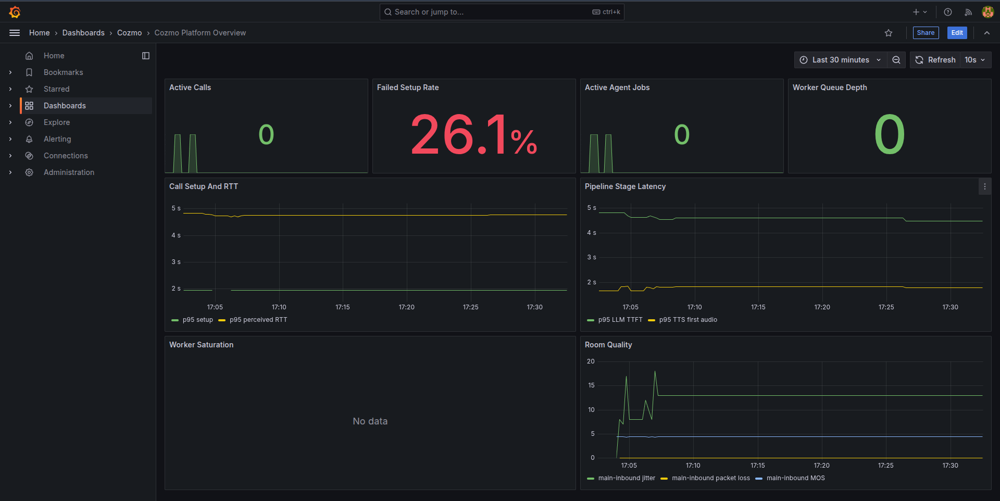

# 🔊 Cozmo AI — Production-Ready Voice Agent Platform

A real-time voice AI agent system built to handle **100+ concurrent inbound PSTN calls** with sub-600ms round-trip latency, knowledge-grounded responses, barge-in support, and full observability.

---

## What This Is

Cozmo is an end-to-end voice AI platform where a caller dials a phone number, an AI agent picks up, understands what they say, retrieves relevant knowledge, thinks, and responds — naturally, fast, and without breaking under load.

The system is designed to work like a real production telephony platform, not a demo. Every call is isolated, observable, recoverable, and instrumented.

---

## 🏗️ Architecture

```
PSTN Caller → Twilio SIP → LiveKit SFU → Agent Worker → [STT → RAG → LLM → TTS] → Caller
                                              ↕                    ↕
                                         FastAPI API          ChromaDB / MongoDB
                                              ↕
                                     Prometheus → Grafana
```

| Layer | Component | Role |
|---|---|---|
| Telephony | Twilio Elastic SIP Trunk | Inbound PSTN call termination |
| Media | LiveKit SIP + SFU | Room creation, WebRTC media routing, participant management |
| Compute | `livekit-agents` workers | Per-call voice pipeline execution |
| STT | Deepgram Nova 3 | Streaming speech-to-text with real-time endpointing |
| TTS | Deepgram Aura 2 | Low-latency text-to-speech synthesis |
| LLM | Gemini 3 Flash | Context-grounded response generation |
| Knowledge | ChromaDB + OpenAI embeddings | RAG retrieval with thresholded top-k |
| Control Plane | FastAPI | Agent config, session management, knowledge APIs, webhooks |
| Persistence | MongoDB 7 | Call sessions, transcripts, agent configuration |
| Observability | Prometheus + Grafana | Per-turn latency, worker health, room quality dashboards |

---

## ✨ Features

### Voice Pipeline
- **Full speech pipeline**: VAD → STT → RAG Retrieval → LLM → TTS per turn
- **Barge-in / interruption**: Caller can interrupt the agent mid-speech — active TTS is cancelled immediately
- **Graceful turn-taking**: VAD + endpointing detect clean speech boundaries before the agent responds
- **Filler speech**: Prevents dead air when knowledge retrieval takes longer than usual

### Knowledge Base (RAG)
- **Vector-grounded responses**: Every turn queries ChromaDB for relevant context before prompting the LLM
- **Thresholded retrieval**: Low-confidence matches are filtered — the model never sees garbage context
- **Explicit fallback path**: When retrieval misses, the agent uses a structured fallback instead of hallucinating
- **Multi-format ingestion**: Supports plain text, FAQ JSON, and file-based content via REST API

### Resilience
- **Worker crash recovery**: If a worker fails mid-call, a replacement job is dispatched to the same room with recent transcript context
- **Recovery lease / deduplication**: Only one recovery attempt per room can be in-flight
- **Transcript write retry + dead-letter queue**: Transient MongoDB failures are retried; persistent failures go to a dead-letter collection
- **Idempotency protection**: Duplicate events and webhook deliveries are suppressed

### Observability
- **Per-turn latency metrics**: STT latency, LLM TTFT, TTS first-audio, perceived RTT, pipeline RTT
- **Worker health**: Active jobs, queue depth, CPU utilization, memory utilization
- **Room quality**: Jitter, packet loss, MOS score — polled from LiveKit RTC stats
- **Call lifecycle**: Setup timing, active calls, failed setup rate
- **Grafana dashboard**: Pre-provisioned "Cozmo Platform Overview" dashboard

### Scaling
- **Horizontal worker scaling**: Add worker servers to handle more concurrent calls
- **Measured concurrency**: Safe jobs-per-worker is a profiled number, not a guess
- **Kubernetes-ready**: Architecture is independently scalable — workers, FastAPI, LiveKit are separate scaling units
- **Documented path to 1,000+ calls**: Provider-layer upgrades + autoscaling + multi-node LiveKit

---

## 📊 Grafana Dashboard



The dashboard tracks:
- Active calls and worker jobs in real-time
- Per-turn latency breakdown (STT, LLM TTFT, TTS, total RTT)
- Worker CPU/memory utilization and queue depth
- Call setup success/failure rate
- Room quality metrics (jitter, packet loss, MOS)

---

## 📁 Project Structure

```
cozmo-ai-project/
├── backend/                 # FastAPI control plane (webhooks, APIs, metrics)
├── agent/                   # LiveKit agent worker (voice pipeline, recovery)
├── knowledge/               # Ingestion, chunking, embedding, retrieval (ChromaDB)
├── contracts/               # Shared Pydantic schemas across services
├── infra/                   # Docker Compose, Prometheus, Grafana, LiveKit config
│   ├── docker-compose.yml
│   ├── prometheus/
│   ├── grafana/
│   └── livekit/
├── tests/
│   ├── e2e/                 # Synthetic end-to-end call flow tests
│   └── load/                # Stepped load tests (25 / 50 / 100 calls)
├── deliverables/            # Architecture docs, PRD, comparison write-ups
├── .env.example             # All required environment variables
├── Makefile                 # Developer shortcuts
└── pyproject.toml           # uv workspace root
```

---

## 🚀 Getting Started

### Prerequisites

- **Python 3.11+**
- **[uv](https://docs.astral.sh/uv/)** (Python package manager)
- **Docker** and **Docker Compose**
- **API Keys**: Twilio, Deepgram, Google Gemini (and optionally OpenAI for embeddings)

### 1. Clone and configure

```bash
git clone <repo-url>
cd cozmo-ai-project

# Copy the environment template and fill in your API keys
cp .env.example .env
```

Edit `.env` and set the required credentials:

```bash
# Required API keys
COZMO_DEEPGRAM_API_KEY=your-deepgram-key
COZMO_GEMINI_API_KEY=your-gemini-key
COZMO_TWILIO_ACCOUNT_SID=your-twilio-sid
COZMO_TWILIO_AUTH_TOKEN=your-twilio-token
COZMO_TWILIO_SIP_DOMAIN=your-twilio-sip-domain

# Optional — enables OpenAI text-embedding-3-small for KB embeddings
# Falls back to local hashed embeddings if not set
COZMO_OPENAI_API_KEY=your-openai-key
```

### 2. Install dependencies

```bash
uv sync --all-packages --dev
```

### 3. Start the full stack with Docker Compose

```bash
# Start all services (MongoDB, ChromaDB, Redis, LiveKit, Prometheus, Grafana, backend, agent)
docker compose -f infra/docker-compose.yml up --build
```

This starts **8 containers**:

| Container | Port | Purpose |
|---|---|---|
| `mongodb` | 27017 | Call sessions, transcripts, agent config |
| `chromadb` | 8001 | Vector store for knowledge base |
| `redis` | 6379 | LiveKit coordination |
| `livekit` | 7880, 7881, 5060/udp, 5061 | SIP ingress + WebRTC SFU |
| `backend` | 8000 | FastAPI control plane + `/metrics` |
| `agent` | 9108 | LiveKit agent worker + `/metrics` |
| `prometheus` | 9090 | Metrics scraping |
| `grafana` | 3000 | Dashboards (default: `admin` / `admin`) |

### 4. Validate the stack

```bash
# Verify Docker Compose config
docker compose -f infra/docker-compose.yml config

# Check container health
docker compose -f infra/docker-compose.yml ps

# Check backend health
curl http://localhost:8000/health

# Check backend readiness (all dependencies)
curl http://localhost:8000/ready

# Check Prometheus targets
open http://localhost:9090/targets

# Open Grafana dashboard
open http://localhost:3000
```

### 5. Seed the knowledge base

```bash
# Ingest the bundled FAQ data into ChromaDB
make kb-seed

# Or manually:
curl -X POST http://localhost:8000/knowledge/ingest \
  -H 'Content-Type: application/json' \
  --data @knowledge/fixtures/main-faq-ingest.json
```

### 6. Running services locally (without Docker)

If you prefer running the backend and agent outside Docker while keeping infrastructure services in Compose:

```bash
# Start only infra services
docker compose -f infra/docker-compose.yml up mongodb chromadb redis livekit prometheus grafana

# In a separate terminal — start the FastAPI backend
make backend
# or: uv run --directory backend uvicorn app.main:app --host 0.0.0.0 --port 8000

# In another terminal — start the agent worker
make agent
# or: uv run --directory agent python agent.py
```

> When running backend/agent on the host, update `.env` to use `localhost` URIs instead of Docker service names:
> - `MONGODB_URI=mongodb://127.0.0.1:27017/cozmo`
> - `COZMO_BACKEND_CHROMA_URI=http://127.0.0.1:8001`
> - `COZMO_BACKEND_LIVEKIT_URL=ws://127.0.0.1:7880`

---

## 🧪 Testing

```bash
# Run unit tests
make unit
# or: uv run --all-packages pytest -m unit

# Run integration tests (requires running infra services)
make integration
# or: uv run --all-packages pytest -m integration

# Run end-to-end synthetic call flow
make e2e
# or: uv run --all-packages pytest tests/e2e

# Run stepped load tests (25 → 50 → 100 concurrent calls)
make load
# or: uv run python -m tests.load.runner --profiles tests/load/profiles.json --output-dir artifacts/load
```

---

## 🐳 Docker Commands Reference

```bash
# Start the full stack
docker compose -f infra/docker-compose.yml up --build

# Start in detached mode
docker compose -f infra/docker-compose.yml up --build -d

# Stop all services
docker compose -f infra/docker-compose.yml down

# Stop and remove volumes (fresh start)
docker compose -f infra/docker-compose.yml down -v

# View logs for a specific service
docker compose -f infra/docker-compose.yml logs -f backend
docker compose -f infra/docker-compose.yml logs -f agent

# Restart a single service
docker compose -f infra/docker-compose.yml restart backend

# Check running containers and ports
docker compose -f infra/docker-compose.yml ps

# Validate the compose file
docker compose -f infra/docker-compose.yml config

# Rebuild a single service
docker compose -f infra/docker-compose.yml build backend
```

---

## 📄 Makefile Shortcuts

| Command | Description |
|---|---|
| `make sync` | Install all packages with dev dependencies |
| `make unit` | Run unit tests |
| `make integration` | Run integration tests |
| `make e2e` | Run end-to-end tests |
| `make load` | Run stepped load tests |
| `make backend` | Start FastAPI backend locally |
| `make agent` | Start agent worker locally |
| `make kb-seed` | Seed the knowledge base with FAQ data |
| `make up` | Start full Docker Compose stack |
| `make down` | Stop Docker Compose stack |
| `make compose-config` | Validate Docker Compose configuration |
| `make lint` | Run ruff linter |

---

## ⚡ Performance Targets

| Metric | Target |
|---|---|
| Perceived RTT (speech-end → agent audio start) | < 600 ms average |
| Perceived RTT p95 | < 900 ms |
| Failed call setup rate | < 1% |
| Barge-in interruption latency | < 200 ms |
| Concurrent call capacity | 100 |

---

## 🔑 Environment Variables

See [`.env.example`](.env.example) for the full list. Key variables:

| Variable | Required | Description |
|---|---|---|
| `COZMO_DEEPGRAM_API_KEY` | ✅ | Deepgram API key for STT and TTS |
| `COZMO_GEMINI_API_KEY` | ✅ | Google Gemini API key for LLM |
| `COZMO_TWILIO_ACCOUNT_SID` | ✅ | Twilio account SID |
| `COZMO_TWILIO_AUTH_TOKEN` | ✅ | Twilio auth token |
| `COZMO_OPENAI_API_KEY` | Optional | OpenAI key for `text-embedding-3-small` embeddings |
| `MONGODB_URI` | ✅ | MongoDB connection string |
| `COZMO_BACKEND_LIVEKIT_URL` | ✅ | LiveKit server WebSocket URL |
| `COZMO_BACKEND_LIVEKIT_API_KEY` | ✅ | LiveKit API key |
| `COZMO_BACKEND_LIVEKIT_API_SECRET` | ✅ | LiveKit API secret |

---

## 📚 Deliverables

| Document | Description |
|---|---|
| [`PRD.md`](deliverables/PRD.md) | Product requirements document |
| [`PLATFORM_ARCHITECTURE.md`](deliverables/PLATFORM_ARCHITECTURE.md) | Full technical architecture with diagrams |
| [`LIVEKIT_VS_PIPECAT.md`](deliverables/LIVEKIT_VS_PIPECAT.md) | Framework comparison write-up |
| [`ONE_PAGER.md`](deliverables/ONE_PAGER.md) | Scaling analysis — what breaks at 1,000 calls |
