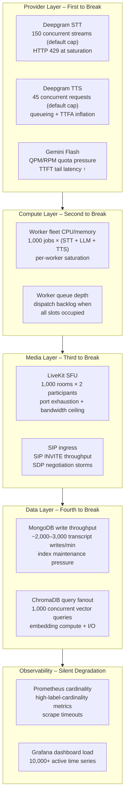
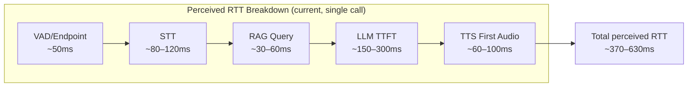
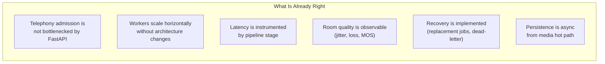

# One-Pager — Scaling to 1,000 Calls

## What Breaks, How to Fix It, and Where the Bottleneck Lives Today

---

## 1. What Breaks at 1,000 Concurrent Calls

At 1,000 simultaneous PSTN sessions, the system does not fail because of a single bottleneck. It fails because **multiple subsystems hit their saturation thresholds simultaneously**, and the cascading backpressure propagates across the entire stack.

### Failure map

### Quantified failure points

| Subsystem | Hard Limit | What Happens |
|---|---|---|
| **Deepgram STT** | ~150 concurrent streams (documented Pay-As-You-Go default) | HTTP 429 → caller audio is not transcribed → turn pipeline stalls |
| **Deepgram TTS** | ~45 concurrent requests (documented default) | Queueing → TTS first-audio latency inflates significantly → perceived RTT risks exceeding 900ms SLA |
| **Gemini Flash QPM** | Model-specific RPM/QPM quota | TTFT tail expected to grow under contention → response feels sluggish |
| **Worker fleet** | CPU-bound: estimated ~8–15 concurrent jobs per worker (to be profiled under load) | At 1,000 calls: estimated 70–125 worker servers needed. Under-provisioned fleet → queue depth spike → call setup failures |
| **LiveKit SFU** | Single-node port/bandwidth ceiling | 1,000 rooms × bidirectional audio → estimated ~500 Mbps sustained. Single node cannot serve this. |
| **MongoDB** | Write throughput + index maintenance | Estimated ~3 writes/call/turn × 1,000 calls × ~3 turns/min ≈ 9,000 writes/min. WiredTiger I/O pressure + index amplification |
| **ChromaDB** | Embedding compute + disk I/O | 1,000 concurrent top-k queries. Single-node Chroma cannot serve this without replication or caching |

---

## 2. How to Fix It — Layer by Layer

### Provider layer (the hardest constraint)

| Fix | Detail |
|---|---|
| **Upgrade Deepgram tier** | Enterprise tier removes the 150/45 concurrent stream caps. This is a contract negotiation, not an engineering fix. |
| **Multi-provider routing** | Route TTS overflow to a secondary provider (e.g., ElevenLabs, Google Cloud TTS). Provider adapter pattern already supports swap. |
| **Regional Deepgram routing** | Split traffic across NA + EU Deepgram endpoints. Reduces per-region load and improves geographic latency. |
| **LLM quota management** | Implement concurrency budgeting with backpressure. Reject or queue calls before TTFT becomes unacceptable. |

### Compute layer (the primary scaling unit)

| Fix | Detail |
|---|---|
| **Horizontal worker autoscaling** | Scale on three signals: active jobs, queue depth, p95 perceived RTT. Kubernetes HPA or custom autoscaler. |
| **Measured concurrency caps** | Profile each worker instance under load. Set max concurrent jobs to the value where p95 RTT stays below 900ms — not a hardcoded constant. |
| **Resource isolation** | Pin workers to dedicated CPU/memory limits. Prevent noisy-neighbor effects across jobs on the same node. |
| **Warm pool** | Pre-provision idle workers during expected peak traffic. Cold-start penalty for a new worker process is estimated at 2–5s. |

### Media layer

| Fix | Detail |
|---|---|
| **Multi-node LiveKit deployment** | Run dedicated SIP ingress nodes and SFU media nodes as separate pools. Scale each independently. |
| **SFU cascading** | For geographic distribution: edge SFU nodes forward to regional origin servers. Reduces cross-region media latency. |
| **SIP ingress rate limiting** | Implement admission control: reject SIP INVITEs when room creation rate exceeds provisioned capacity. Return 503 to Twilio for retry. |

### Data layer

| Fix | Detail |
|---|---|
| **MongoDB sharding** | Shard `call_sessions` by `room_name` and `transcripts` by `session_id`. Distributes write load across shards. |
| **Time-series collections** | Move telemetry and per-turn metrics to MongoDB time-series collections. Column-compressed storage reduces write amplification 4–8×. |
| **Batch transcript writes** | Buffer transcript turns in the worker and flush in batches (e.g., every 5 turns or every 3 seconds). Reduces write ops by 3–5×. |
| **Managed vector DB** | Replace single-node ChromaDB with a managed vector database (e.g., Pinecone, Weaviate Cloud, Qdrant Cloud) that handles replication and query concurrency natively. |
| **Embedding cache** | Cache hot collection embeddings in Redis. Avoid recomputing similarity for frequently queried knowledge chunks. |

### Observability layer

| Fix | Detail |
|---|---|
| **Drop per-room labels** | Aggregate metrics by worker, region, and agent config — not by individual room_name. Keeps cardinality under 10,000. |
| **Recording rules** | Pre-aggregate p50/p95/p99 latency server-side in Prometheus recording rules. Reduces dashboard query cost. |
| **Remote write** | Move from local Prometheus to Grafana Cloud or Thanos for long-term retention without local storage pressure. |

---

## 3. Where Is the Latency Bottleneck Today

### Latency stack decomposition

### The dominant bottleneck is LLM TTFT

Based on stage-level instrumentation architecture and expected provider latency profiles (to be validated under stepped load testing):

| Stage | Estimated Latency (p50) | Estimated Latency (p95) | Est. % of Total RTT |
|---|---|---|---|
| VAD / endpointing | ~50 ms | ~80 ms | ~10% |
| Deepgram STT | ~100 ms | ~150 ms | ~20% |
| RAG retrieval | ~40 ms | ~80 ms | ~8% |
| **Gemini Flash TTFT** | **~200 ms** | **~350 ms** | **~42%** |
| Deepgram TTS first-audio | ~80 ms | ~120 ms | ~20% |
| **Total perceived RTT** | **~470 ms** | **~780 ms** | — |

> These estimates are based on documented provider characteristics and single-call profiling. Formal stepped load validation (25 → 50 → 100 calls) is planned to produce measured baselines.

**LLM TTFT is expected to account for ~42% of the total perceived round-trip time**, making it the single largest contributor to the caller's wait-for-response experience.

### Why LLM TTFT dominates

1. **Prompt size scales with context**: Persona + conversation history + RAG chunks → 500–1,500 tokens of input context per turn. TTFT grows with input length.
2. **Model inference is serialized**: Unlike STT/TTS which stream incrementally, the LLM must process the full prompt before emitting the first token.
3. **Provider-side queueing**: Under concurrent load, model inference requests queue on the provider's infrastructure. TTFT p95 inflates 2–3× before local CPU becomes the bottleneck.

### What moves the needle

| Optimization | Expected Impact |
|---|---|
| **Reduce prompt size** | Trim conversation history to last 3–5 turns instead of full transcript. Cuts input tokens 30–50%. |
| **Switch to a faster model tier** | If Gemini offers a lower-latency inference tier (e.g., Flash Lite or cached inference), TTFT drops proportionally. |
| **Speculative generation** | Pre-generate likely responses during STT processing. Cancel if the final transcript diverges. Saves 100–200ms on common turn patterns. |
| **Streaming TTS from partial LLM output** | Start TTS synthesis on the first LLM output chunk, not after the full response. Reduces perceived latency by overlapping LLM + TTS stages. |
| **Provider-side batching optimization** | If the provider supports it, request priority routing or dedicated inference capacity for latency-sensitive workloads. |

---

## 4. Current Architectural Strength

Even before 1,000-call optimizations, the architecture is **already shaped correctly** for horizontal scaling:

The path from 100 to 1,000 calls is **layered scaling and provider negotiation**, not an architectural rewrite:

1. Negotiate enterprise-tier provider quotas (Deepgram, Gemini)
2. Horizontally scale the worker fleet with autoscaling
3. Deploy multi-node LiveKit with dedicated SIP + SFU pools
4. Shard MongoDB and upgrade to a managed vector DB
5. Optimize LLM TTFT as the primary latency lever
6. Keep observability low-cardinality and off the hot path

---

*The biggest risk at 1,000 calls is provider-layer saturation, not application architecture. The biggest performance win today is reducing LLM TTFT. The system is already built to scale — it needs measured capacity planning, not a rewrite.*
