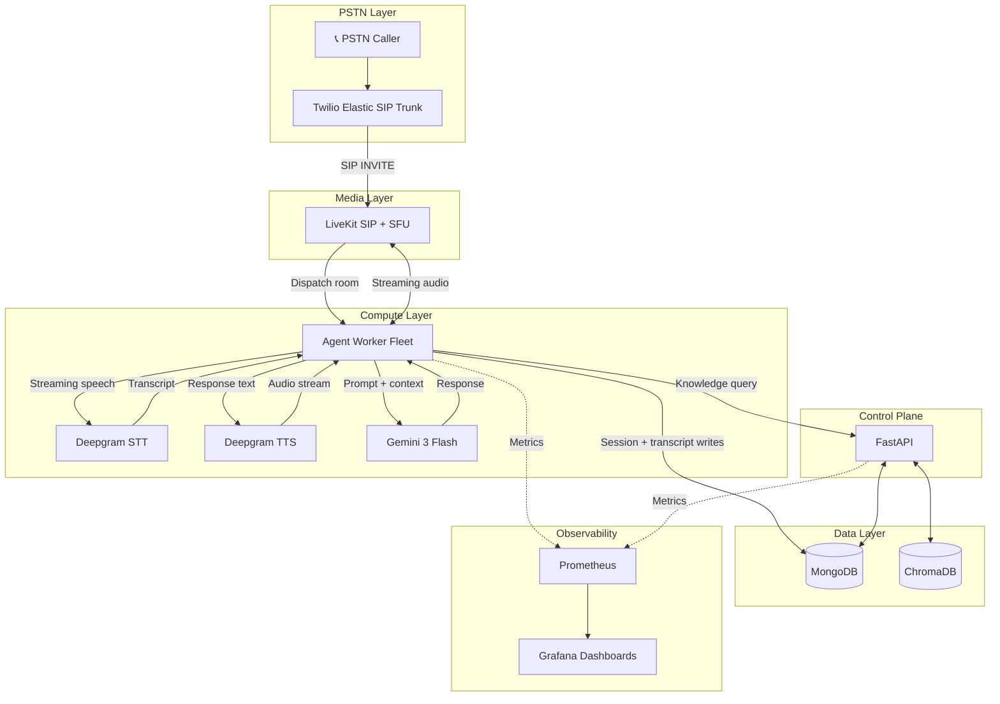
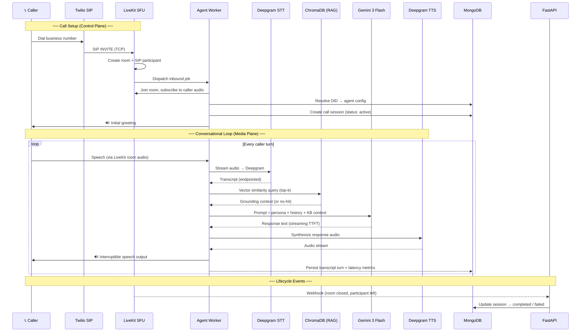
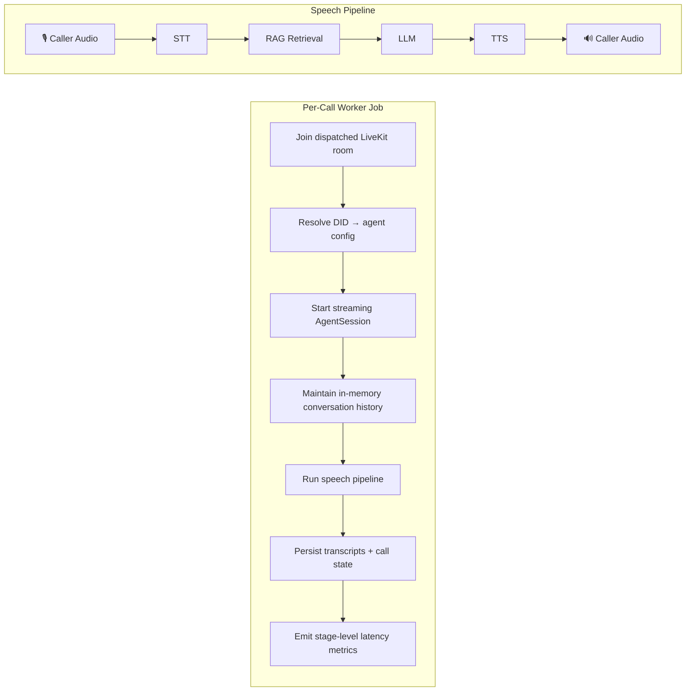
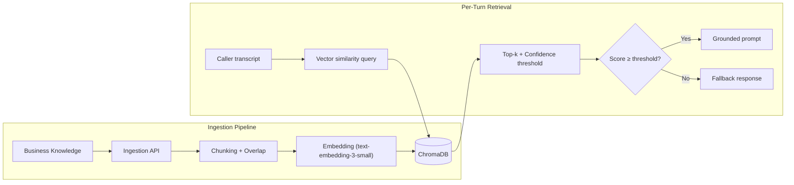
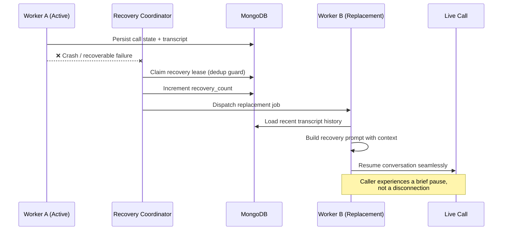
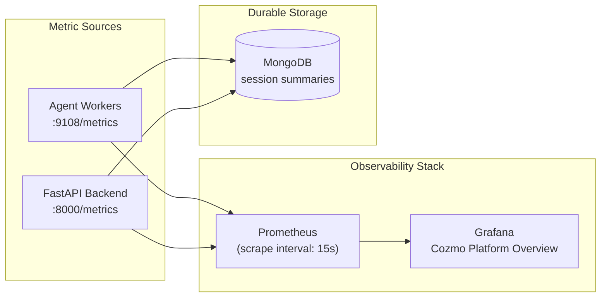
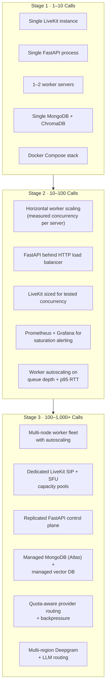

# Platform Architecture — Cozmo AI Voice Agent

**Version:** 3.0 · **Last updated:** April 2026

---

## 1. Architecture Principles

The platform is designed around a single core rule: **keep the inbound PSTN and media path as short as possible**, and move control, persistence, retrieval, and observability to adjacent systems that never sit on the first-hop call setup path.

| Concern | Component | Role |
|---|---|---|
| PSTN ingress | Twilio Elastic SIP Trunk | Terminates inbound calls, forwards SIP INVITE |
| Media transport | LiveKit SIP + SFU | Room creation, participant dispatch, WebRTC media |
| Per-call execution | `livekit-agents` worker fleet | Voice pipeline: VAD → STT → RAG → LLM → TTS |
| Speech-to-text | Deepgram Streaming STT | Low-latency endpointing and transcription |
| Speech synthesis | Deepgram Streaming TTS | Real-time audio synthesis |
| Response generation | Gemini 3 Flash | Context-grounded response generation |
| Control plane | FastAPI | Agent config, knowledge APIs, session storage, metrics, webhooks |
| Persistence | MongoDB | Call sessions, transcripts, agent configuration |
| Vector retrieval | ChromaDB | Knowledge base ingestion and semantic search |
| Observability | Prometheus + Grafana | Metrics scraping, dashboards, alerting |

This separation keeps call admission **deterministic** while still giving the system a strong control plane, retrieval layer, and operator visibility.

---

## 2. High-Level System Architecture

### Why this structure works

- **Twilio + LiveKit handle telephony admission and media routing directly**, so FastAPI is never in the call setup critical path. A call connects to a worker in under one SIP INVITE → room dispatch cycle.
- **Workers own the live conversation state** for the duration of the call. Turn-taking, barge-in, and interruption handling all execute at media-loop speed inside the worker process.
- **FastAPI is the durable control plane** — agent configuration, session inspection, transcript queries, knowledge ingestion, and Prometheus metrics. It does not block any call setup.
- **Vector retrieval is invoked per-turn at response time**, not pre-baked into static prompts. This keeps answers current and grounded.

---

## 3. Call Flow — Control Plane + Media Pipeline

### Critical design choices in this flow

| Choice | Rationale |
|---|---|
| Worker is the conversational state owner | Turn-taking, barge-in, and interruption all require the active process to hold live state. No round-trips to a database on the hot path. |
| Retrieval is invoked at response time | Not pre-baked into static prompts. Each turn gets fresh, relevant context from the knowledge base. |
| Transcript and session writes are async | They are side-effects, not blockers for the caller-facing media loop. The caller never waits on a MongoDB write. |
| Barge-in is handled inside the worker | The worker sees both TTS playback state and caller speech simultaneously, so it can cancel playback within ~200 ms. |
| Filler speech covers retrieval latency | When RAG takes noticeably longer, the agent uses filler speech to prevent dead air while the system checks the knowledge base. |

---

## 4. Conversational Runtime Design

Each active call runs as an **isolated worker job** with the following responsibilities:

### Voice UX capabilities

| Capability | Implementation |
|---|---|
| **Interruptible TTS (Barge-in)** | Caller speech cancels active TTS playback immediately. Queued audio frames are dropped. |
| **Graceful turn-taking** | VAD + endpointing detect speech boundaries. Agent waits for a clean endpoint before responding. |
| **Recovery-aware bootstrap** | Replacement workers load recent transcript history and resume with a recovery prompt. |
| **Knowledge-grounded responses** | Every turn queries ChromaDB. Responses are built from retrieved context when confidence is above threshold. |
| **No-answer fallback** | When retrieval confidence is low, the agent uses an explicit fallback response instead of hallucinating. |
| **Objection handling** | A policy router directs objections to scripted trust-handling, LLM generation, or human-transfer paths. |

---

## 5. Knowledge Retrieval Architecture

The knowledge subsystem is a proper **RAG retrieval layer**, not a static prompt attachment.

### Design properties

- **Chunked with overlap** to preserve answer continuity across document boundaries.
- **Thresholded retrieval** — low-confidence matches are filtered before they reach the prompt. The model never sees garbage context.
- **Explicit no-answer path** — when retrieval misses, the system uses a structured fallback rather than relying on the LLM to self-restrain from hallucination.
- **Multi-format ingestion** — supports plain text, structured FAQ JSON, and file-based content.

---

## 6. Recovery and Reliability

The platform implements **real recovery behavior**, not only monitoring.

### Recovery sequence

### Implemented recovery mechanisms

| Mechanism | Description |
|---|---|
| **Replacement-job dispatch** | When a worker crash is detected, a replacement job is dispatched to the same room. The new worker loads transcript history and resumes with context. |
| **Recovery lease / dedup** | A lease prevents multiple replacement attempts for the same room. Only one recovery can be in flight at a time. |
| **Transcript write retry** | Transient MongoDB write failures are retried with backoff before falling to the dead-letter path. |
| **Dead-letter queue** | Transcript writes that fail after retry are persisted to a dead-letter collection for later replay. |
| **Idempotency protection** | Duplicate transcript events and webhook deliveries are suppressed by idempotency keys. |

---

## 7. Observability Architecture

Prometheus and Grafana are wired into **both** the backend and the worker fleet.

### Metrics taxonomy

| Category | Metrics |
|---|---|
| **Call setup** | Call setup time (ms), failed setup rate, active calls |
| **Per-turn latency** | Perceived RTT, pipeline RTT, STT latency, LLM TTFT, TTS first-audio latency |
| **Worker health** | Active jobs, queue depth, CPU utilization, memory utilization |
| **Room quality** | Jitter (ms), packet loss (%), MOS score |
| **Recovery** | Recovery count, dead-letter queue depth |

### Why both worker and backend metrics exist

- **Worker metrics** capture live stage latency, worker saturation, and in-call behavior. These are real-time signals.
- **Backend metrics** capture durable session state: active call counts, failed setup rate, persisted room-quality snapshots. These survive after short-lived worker jobs exit.

That split makes the dashboard **resilient** — the operator always has visibility even when individual worker processes have already terminated.

---

## 8. Scaling Plan — 1 → 100 → 1,000 Calls

### Worker scaling model

The worker layer is the **primary horizontal scaling unit**:

- One worker server hosts multiple active jobs.
- Safe concurrency per worker is a **measured number**, not a guessed constant — derived from observed CPU, memory, and p95 RTT under load.
- **Worker queue depth** is the first operational alarm that more capacity is needed.
- Autoscaling triggers: active jobs, queue depth, p95 perceived RTT.

### Load balancing and orchestration strategy

| Scale | Strategy |
|---|---|
| **Local / take-home** | Docker Compose. All services on one machine. Sufficient for development and demo. |
| **10–100 calls** | FastAPI behind an HTTP LB (e.g., Nginx, ALB). Workers replicated horizontally. LiveKit sized for tested concurrency. |
| **100–1,000+ calls** | Kubernetes becomes a natural fit — worker autoscaling, stateless FastAPI replicas, rollout management, resource isolation. But the architecture does **not require** Kubernetes to be conceptually scalable. |

### Why this architecture scales from 1 to 100+

| Property | Why it matters |
|---|---|
| Telephony admission offloaded to Twilio + LiveKit | FastAPI is not in the call setup path |
| Worker fleet is horizontally scalable | Add servers, not complexity |
| MongoDB writes are async from media path | Persistence never blocks the caller |
| Retrieval and LLM calls are isolated per job | No shared mutable state between calls |
| Observability exposes real saturation points | You know *where* to scale before it breaks |

Reaching 100 concurrent calls is an exercise in **measured worker concurrency, LiveKit capacity sizing, and provider throughput** — not an architectural rewrite.

---

## 9. Key Trade-Offs

### What this design optimizes for

- ✅ Telephony correctness and fast call setup
- ✅ Low operational ambiguity — every component has a single, clear responsibility
- ✅ Strong observability — stage-level latency, worker saturation, room quality
- ✅ Incremental scalability — scale layers independently
- ✅ Clean separation between media plane and control plane

### What this design deliberately does not optimize for

- ❌ Minimum component count — the system has more components than a quick demo, but each earns its place
- ❌ Zero external dependencies — Twilio, Deepgram, and Gemini are external, but they are the best-in-class choices for this use case
- ❌ Ultra-cheap prototype-only architecture — the structure is what makes the system believable at 100-call scale

---

## 10. Summary

This platform architecture meets every architectural requirement in the assignment:

| Requirement | How it is met |
|---|---|
| Scale 1 → 100+ concurrent calls | Horizontal worker scaling, offloaded telephony, async persistence |
| Workers, load balancing, orchestration | Worker fleet with measured concurrency, HTTP LB for FastAPI, Kubernetes-ready |
| Failure recovery mechanism | Replacement-job dispatch with transcript recovery, write retry, dead-letter, idempotency |
| Diagrams for every major flow | High-level architecture, call flow, scaling plan, retrieval, recovery, observability |
| Observability | Prometheus + Grafana with per-turn latency, worker health, room quality, setup timing |

The remaining proof point is **performance validation under stepped load**, not an architectural rewrite.
